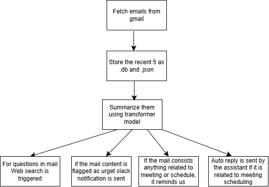

# 📧 Email Assistant with LLM Integration

An intelligent email assistant that fetches your Gmail messages and processes them with LLM-powered tools. It supports functionalities like parsing email content, storing data in a local database, and interacting with additional tools like Slack, Web search.

---

## 🛠 Features

- 📥 Fetch emails from Gmail
- 🧠 Summarize emails using LLM
- ✉️ Auto-reply to important ones (here for meeting postponement)
- 📅 Check if recent mails contain anything related to meeting or any schedule
- 🔔 Notify on Slack
- 🌐 Use web search for context

---

## 📁 Project Structure

```
email_assistant/
│
├── src/
│   ├── controllers/         # Main orchestration logic (e.g., main.py)
│   ├── services/            # External service integrations (Gmail, Web search, Automated reply, etc.)
│   ├── utils/               # Helper functions & configuration
│   │   ├── config.py        # Your email credentials and constants
│   └── database/            # SQLite logic for saving emails
│
├── .gitignore
├── requirements.txt
└── README.md
```

---

## ⚙️ Setup Instructions

### 1. 🧪 Clone and Install Requirements

```bash
git clone <repo-url>
cd email_assistant
pip install -r requirements.txt
```

### 2. 🔐 Configure Gmail Access

Fill config_copy.py with necessary tokens and rename as config.py. 

---

## 🚀 Running the Assistant

Navigate to the email_assistant directory and run:

```bash
python -m src.controllers.main
```

It will:
- Connect to your Gmail inbox
- Fetch recent emails from the **Primary** tab
- Parse subject, sender, body, timestamp
- Save emails to `primary_emails.json` and SQLite DB (`emails.db`)

---

## 🧠 Architecture Overview

The assistant has three main components:

1. **Email Fetcher**: Connects to Gmail and fetches recent messages.
2. **LLM & Tools**: Processes parsed data and invokes logic (e.g., checks if any meeting is there or if any urgent mail is there it sends notification to Slack).
3. **Storage & Actions**: Stores emails in a database 

### 🖼 Architecture Diagram

  

---

## 📦 Output Files

- `primary_emails.json`: JSON dump of fetched emails
- `emails.db`: SQLite database containing structured email data

---
 
